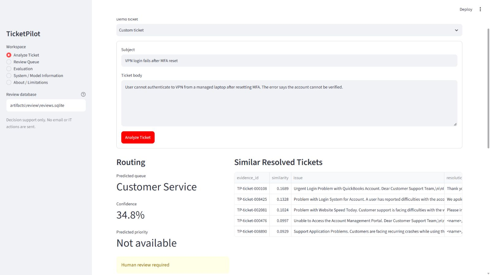
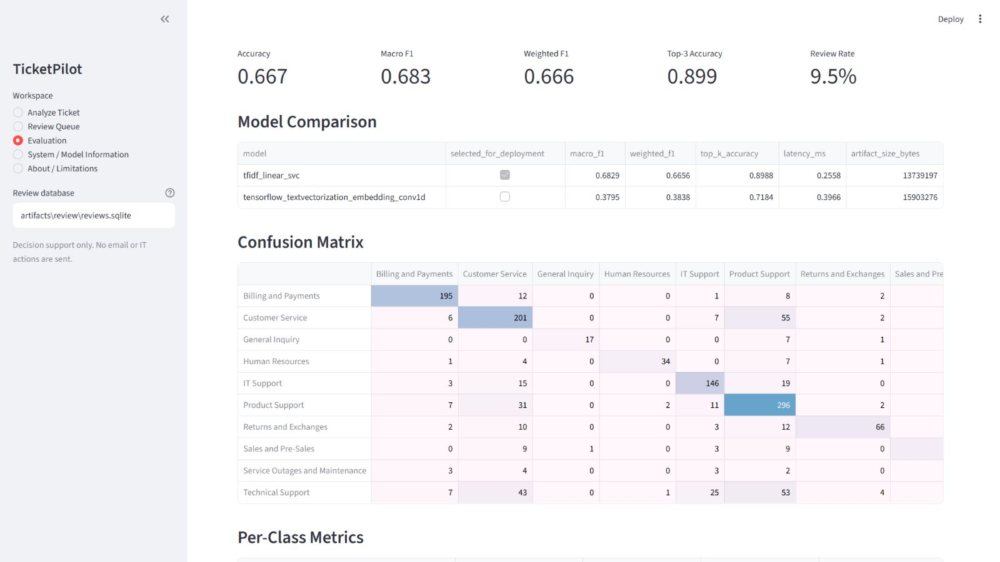
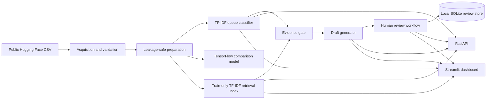

# TicketPilot

TicketPilot is a portfolio prototype for human-reviewed IT support triage: it
predicts a support queue, retrieves similar resolved tickets, drafts a cited
response when evidence is strong enough, and keeps every outcome behind human
review.

It does **not** autonomously send responses, close tickets, reset passwords,
change permissions, issue refunds, or perform helpdesk actions.

**Demo status:** local Streamlit dashboard verified with prepared artifacts;
hosted demo and walkthrough video are not published yet.





> **Release mode:** this repository is currently prepared for repo-only
> recruiter review. Real local Streamlit screenshots are included above.
> Hosted demo and demo video links should wait until Docker is verified on a
> machine with Docker installed. The Streamlit app runs locally at
> `http://127.0.0.1:8501` after artifacts are prepared.

## Overview

Support queues receive incomplete, noisy tickets. A triage assistant can help a
human reviewer by suggesting where the ticket belongs, finding related solved
cases, and preparing a cautious draft response with citations. The hard part is
doing that without leaking post-resolution fields into training, overclaiming
model certainty, or letting generated text bypass review.

TicketPilot demonstrates that workflow as a local AI-engineering portfolio
system. It combines classical NLP, a TensorFlow comparison model, retrieval,
RAG-style drafting, confidence gates, a FastAPI service, a Streamlit review UI,
Docker packaging, and CI checks.

Current measured results from repository artifacts:

| Area | Result |
| --- | --- |
| Selected queue classifier | TF-IDF + calibrated LinearSVC |
| Final-test queue macro F1 | `0.6829` |
| Final-test queue accuracy | `0.6673` |
| Final-test top-3 routing accuracy | `0.8988` |
| Confidence threshold | `0.30`, selected on validation |
| Final-test review rate at threshold | `9.51%` flagged for additional review |
| Deployed retriever | TF-IDF cosine similarity |
| TF-IDF retrieval final-test Recall@5 | `0.8755` using silver queue-match relevance |
| Human-labeled gold retrieval test Recall@5 | `1.0000` on 20 labeled test queries |
| Evidence threshold for drafting | `0.39`, selected on gold validation labels |
| Priority prediction | Unsupported in v1; API returns `null` |

Main technologies: Python 3.11, scikit-learn, TensorFlow/Keras, pandas, numpy,
FastAPI, Streamlit, SQLite, pytest, Ruff, mypy, Docker, and GitHub Actions.

## Demo

### Local dashboard

The dashboard screenshots above were captured from the actual local Streamlit
application with prepared classifier, retrieval, and report artifacts. To run
the same local dashboard:

```powershell
.\scripts\run_streamlit_app.ps1
```

Then open `http://127.0.0.1:8501`.

### Hosted demo

Not published yet. Docker packaging exists, but Docker build and Compose
verification still need to be run on a machine with Docker installed before a
hosted demo should be advertised.

### Demo video

Not published yet. Record a two-to-three-minute walkthrough using
[docs/DEMO_SCRIPT.md](docs/DEMO_SCRIPT.md) after Docker verification is
complete.

Suggested demo path:

1. Open the Streamlit dashboard.
2. Choose a synthetic demo ticket.
3. Run analysis.
4. Show predicted queue, confidence, retrieved evidence, draft/abstention
   status, citations, and review controls.
5. Show `/model-info` to verify priority prediction is unsupported and TF-IDF
   retrieval is the deployed retriever.

## Architecture



The runtime path loads persisted local artifacts explicitly. It does not train
models, download the dataset, or require Hugging Face access during startup.
The Streamlit dashboard uses the core orchestration service directly; the
FastAPI service exposes the same workflow through HTTP endpoints.

## End-to-end workflow

1. Fetch and validate the pinned public dataset.
2. Filter to English records and prepare duplicate-aware train/validation/test
   splits.
3. Build classifier text from `subject + body` only.
4. Train scikit-learn queue-routing baselines and select by validation macro F1.
5. Fit the calibrated confidence model without using final-test data.
6. Train a TensorFlow Conv1D text classifier for comparison only.
7. Build a train-only TF-IDF retrieval index over resolved ticket subject/body
   text.
8. Evaluate lexical, semantic, and hybrid retrieval offline.
9. Run analysis: classify queue, retrieve similar solved tickets, apply
   confidence/evidence gates, draft or abstain, and require human review.
10. Persist reviewer decisions locally in SQLite.

## Dataset

TicketPilot uses the English subset of
`Tobi-Bueck/customer-support-tickets`, pinned to revision
`ddf1c81a5475992c4fa6752bf1e8b4e31f07bbeb`. The Hugging Face dataset lists
license `cc-by-nc-4.0` and DOI `10.57967/hf/6184`.

Observed source data:

- Source rows: `28,587`
- English rows used by v1: `16,338`
- Train/validation/test split: `11,438 / 2,450 / 2,450`
- Classifier text sources: `subject`, `body`
- Prohibited classifier inputs: `answer`, labels, language, version, type, and
  tag fields
- Missing English `subject` values: `2,607`; `body` is non-empty for all
  English rows

See [docs/DATA_CARD.md](docs/DATA_CARD.md) for schema, validation checks,
label distributions, leakage diagnostics, and limitations.

## Queue classification

Implemented queue-routing baselines:

- Dummy most-frequent classifier
- TF-IDF + logistic regression
- TF-IDF + LinearSVC

The selected baseline is `tfidf_linear_svc`, chosen by validation macro F1.
The final confidence-bearing model uses sigmoid calibration with
`CalibratedClassifierCV(cv=3)`.

Final-test metrics for the selected calibrated scikit-learn model:

| Metric | Value |
| --- | ---: |
| Accuracy | `0.6673` |
| Macro precision | `0.7765` |
| Macro recall | `0.6294` |
| Macro F1 | `0.6829` |
| Weighted F1 | `0.6656` |
| Top-3 routing accuracy | `0.8988` |

Automated priority prediction is intentionally unsupported for recruiter-ready
v1. Runtime analysis returns `predicted_priority: null`.

## TensorFlow comparison

TicketPilot includes a TensorFlow/Keras comparison model with
`TextVectorization`, embedding, `Conv1D`, global max pooling, dropout, class
weights, and early stopping. It is an experiment, not the deployed model.

Validation comparison kept scikit-learn as the deployment candidate:

| Model family | Validation macro F1 | Final-test macro F1 |
| --- | ---: | ---: |
| Calibrated sklearn TF-IDF LinearSVC | `0.6455` | `0.6829` |
| TensorFlow Conv1D text model | `0.3745` | `0.3795` |

The TensorFlow model had lower measured final-test latency in the local report,
but routing quality was worse, so the documented deployment decision keeps the
scikit-learn baseline.

## Retrieval

The deployed v1 retriever is a train-only TF-IDF cosine similarity index. It
returns stable source IDs, subject, body, resolved answer, queue, priority, and
similarity score. The `answer` field is returned as evidence but is not used to
build classifier or query text.

TF-IDF retrieval metrics using silver queue-match relevance:

| Split | Recall@1 | Recall@3 | Recall@5 | MRR |
| --- | ---: | ---: | ---: | ---: |
| Validation | `0.7449` | `0.8241` | `0.8686` | `0.7884` |
| Final test | `0.7445` | `0.8318` | `0.8755` | `0.7916` |

Semantic and hybrid retrieval were evaluated offline with
`sentence-transformers/all-MiniLM-L6-v2`. The 50/50 hybrid won validation
Recall@5 in the offline report, but it is not deployed because reproducible
semantic query encoding is not packaged as a local runtime artifact. The
dashboard's Evaluation page may display the offline hybrid report when that
ignored report artifact exists locally; `/model-info` remains the source of
truth for the active runtime retriever.

## RAG

RAG-style drafting is provider-neutral:

- deterministic fake generator for tests and offline demo behavior
- optional OpenAI Responses provider only when explicitly invoked
- production prompt stored in [src/ticketpilot/rag_prompts.py](src/ticketpilot/rag_prompts.py)

Drafting is gated by classifier confidence and retrieval evidence quality.
Current defaults:

- minimum classifier confidence: `0.30`
- minimum retrieved evidence similarity: `0.39`

When gates fail or the provider fails, TicketPilot returns a structured
human-review-required abstention instead of a confident draft.

## Human review

Every analysis requires human review. The local review workflow stores:

- analysis ID
- ticket text hash
- predicted queue and confidence
- retrieved evidence IDs
- draft response
- reviewer action
- edited response or final queue when supplied
- audit timestamps

Allowed reviewer actions are `accept`, `edit`, `reject`, `reroute`, and
`mark_insufficient_evidence`. The system records decisions only; it does not
send or execute anything.

## Evaluation results

Evaluation artifacts are stored under ignored `reports/` paths. Highlights:

- Duplicate-aware split preparation found `16,338` English tickets and no exact
  duplicate `subject + body` groups.
- Near-duplicate audit found `98` cross-split candidate pairs at TF-IDF cosine
  similarity `>= 0.90`; all had matching queue and priority labels.
- Selected queue model final-test macro F1 is `0.6829`.
- TensorFlow comparison underperformed the selected scikit-learn model.
- TF-IDF retrieval final-test Recall@5 is `0.8755` under silver queue-match
  relevance.
- Gold retrieval evaluation covers 20 validation and 20 test queries with 100
  labeled candidates per split.
- Gold validation selected evidence threshold `0.39`; gold test at that fixed
  threshold allowed 50% of queries with 100% precision among allowed queries in
  the labeled sample.

## Confidence and abstention

The queue confidence threshold `0.30` was selected on validation with a minimum
coverage target of 70%. On final test, that threshold:

- covers `90.49%` of tickets
- sends `9.51%` to additional review
- reaches `0.7009` accuracy on above-threshold recommendations
- reaches `0.7231` macro F1 on above-threshold recommendations

This is a portfolio evaluation result, not an approved operational policy.
Human review is still required before any response or action.

## Security and prompt-injection handling

Implemented controls:

- No private employer, university, customer, or real support-ticket data.
- `.env` files, raw datasets, generated artifacts, model files, and SQLite
  databases are ignored by Git.
- Optional OpenAI API key is read only when OpenAI drafting is explicitly used.
- Tests use fake/local providers and do not require paid API calls.
- Retrieved ticket text is treated as untrusted data in the prompt.
- Prompt-injection tests verify malicious instructions embedded in evidence are
  not followed by the fake generator.
- API readiness fails closed when required local classifier or retriever
  artifacts are missing.

See [docs/SECURITY.md](docs/SECURITY.md).

## API

FastAPI entrypoint:

```powershell
.\.venv\Scripts\python.exe -m uvicorn ticketpilot.api:app --host 127.0.0.1 --port 8000
```

Implemented endpoints:

- `GET /health`
- `GET /model-info`
- `POST /classify`
- `POST /retrieve`
- `POST /analyze`
- `POST /reviews`
- `GET /reviews/{id}`

Example analysis request:

```powershell
$body = @{
  subject = "VPN login fails after MFA reset"
  body = "User cannot authenticate to VPN from a managed laptop after resetting MFA."
  top_k = 3
} | ConvertTo-Json

Invoke-RestMethod `
  -Uri "http://127.0.0.1:8000/analyze" `
  -Method Post `
  -ContentType "application/json" `
  -Body $body
```

## Local setup

```powershell
.\scripts\setup.ps1
.\scripts\verify.ps1
```

Prepare local artifacts:

```powershell
.\scripts\fetch_data.ps1
.\.venv\Scripts\python.exe scripts\prepare_dataset.py
.\.venv\Scripts\python.exe scripts\train_queue_baseline.py
.\.venv\Scripts\python.exe scripts\build_retrieval_baseline.py
```

Run the dashboard:

```powershell
.\scripts\run_streamlit_app.ps1
```

The minimum runtime artifacts are:

- `artifacts/queue_baseline/selected_queue_router.joblib`
- `artifacts/retrieval/tfidf_ticket_retriever.joblib`
- `reports/queue_baseline/queue_baseline_metrics.json`

## Docker

Docker support is configured for a recruiter/demo workflow, but Docker build and
Compose checks have not been verified in this environment because Docker is not
installed/on PATH here.

The image is intentionally lightweight: it installs runtime dependencies and
source code only. Generated classifier, retrieval, report, and review artifacts
stay outside Git and outside the image; Docker Compose mounts prepared local
artifacts read-only at runtime.

```powershell
docker build -t ticketpilot:local .
docker compose up --build
Invoke-RestMethod http://127.0.0.1:8000/health
Invoke-RestMethod http://127.0.0.1:8000/model-info
docker compose down
```

Compose starts separate API and Streamlit services from one image and mounts the
prepared local model/retrieval artifacts at runtime.

## Testing

Configured checks:

```powershell
.\.venv\Scripts\python.exe -m ruff check .
.\.venv\Scripts\python.exe -m ruff format --check .
.\.venv\Scripts\python.exe -m mypy src tests
.\.venv\Scripts\python.exe -m pytest
.\scripts\verify.ps1
```

Latest local verification in this workspace: `135 passed, 1 skipped, 1 warning`
from pytest, plus Ruff, Ruff format, and mypy passing through
`scripts/verify.ps1`.

## Limitations

- Portfolio prototype, not a production helpdesk product.
- No authentication, RBAC, monitoring, hosted deployment, or production
  operations.
- Docker files are present, but Docker runtime verification is pending.
- Dataset is synthetic/public and non-commercially licensed.
- Final test metrics are reporting-only and have historical inspection
  limitations documented in the model card.
- Some rare queues have small support and weaker recall.
- Priority prediction is unsupported.
- Hybrid semantic retrieval is offline-evaluated but not deployed.
- OpenAI generation is optional and not required for local classification or
  retrieval.

## Roadmap

- Verify Docker build and Compose startup on a Docker-enabled machine.
- Add hosted demo and demo video links.
- Add authentication/RBAC before any non-local deployment.
- Add monitoring and structured operational logging.
- Improve queue error analysis for low-recall and low-support classes.
- Revisit semantic/hybrid retrieval only after reproducible local query encoder
  packaging.
- Expand human-labeled retrieval and drafting evaluation before changing
  evidence thresholds.

## Dataset/license attribution

Dataset: `Tobi-Bueck/customer-support-tickets` on Hugging Face. The dataset page
lists license `cc-by-nc-4.0`, DOI `10.57967/hf/6184`, and creator organization
Softoft. TicketPilot pins revision `ddf1c81a5475992c4fa6752bf1e8b4e31f07bbeb`
and source SHA256
`f187c090e59581c2bbf3aa1377c8db4dd647464ecf2ae51bf8966e42e0ed6bc0`.

This portfolio project should remain non-commercial unless separate permission
or a different dataset license is obtained.
