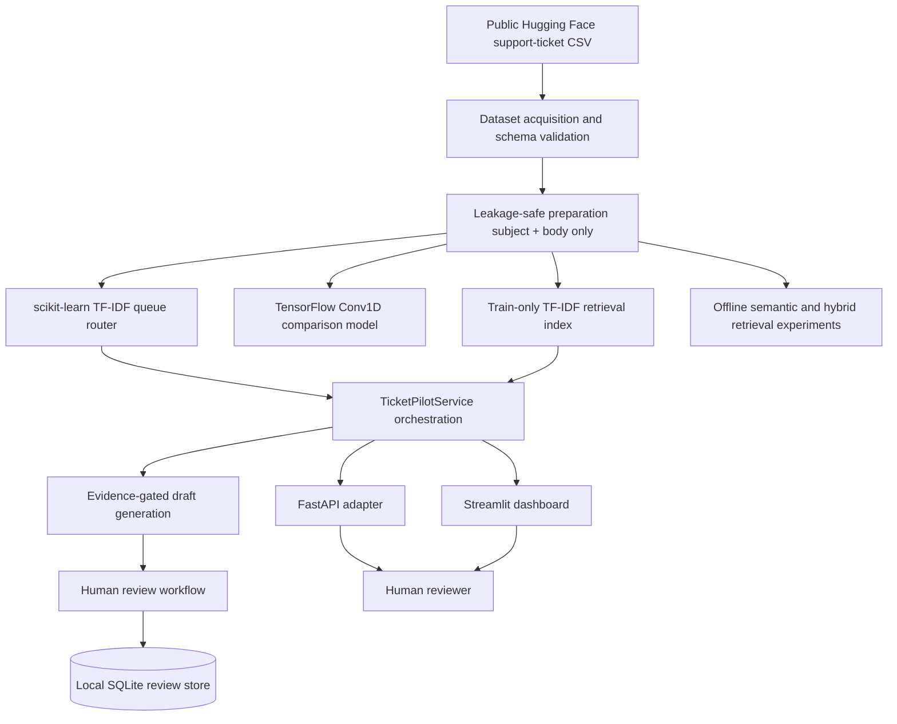

# Architecture

## Current Architecture

TicketPilot currently contains local, testable components for public-data
ingestion, leakage-safe preparation, queue classification, retrieval,
evidence-grounded draft generation, human-review persistence, core workflow
orchestration, a FastAPI service, and a local Streamlit dashboard.

There is no hosted production deployment, no email sender, and no autonomous
support-action executor.

## Architecture Diagram

## Implemented Components

1. Data ingestion and validation
   - Load public or synthetic support-ticket data.
   - Validate required fields, types, labels, and provenance.
   - Reject fields that would not be available before routing.

2. Preprocessing
   - Normalize ticket title and body text.
   - Keep training and inference preprocessing consistent.
   - Fit preprocessing only on training data.

3. Baseline classification
   - Use scikit-learn TF-IDF features and simple classifiers.
   - Recommend a support queue for human review.
   - Report calibrated confidence where appropriate.

4. Advanced text modeling
   - Add TensorFlow text modeling only after the baseline is verified.
   - Compare against the baseline using the same validation protocol.

5. Retrieval
   - Retrieve similar resolved tickets from approved public or synthetic data.
   - Keep retrieved evidence separate from generated draft text.

6. RAG draft generation
   - Produce response drafts grounded in retrieved evidence.
   - Preserve citations to source evidence.
   - Keep production prompts in version-controlled source code.

7. Abstention and human review
   - Flag low-confidence predictions.
   - Flag weak-evidence retrieval results.
   - Require human review before any response is sent or action is taken.
   - Persist local review decisions in SQLite for portfolio v1.

8. Application surfaces
   - FastAPI service for local inference and review-record persistence.
   - Streamlit support-agent console for portfolio demonstration.
   - Production deployments must add authentication and RBAC.

9. Evaluation
   - Classification metrics.
   - Leakage checks.
   - Retrieval metrics.
   - RAG citation and groundedness checks.
   - Human-review policy tests.

10. Packaging and CI
   - Dockerfile, `.dockerignore`, and Docker Compose configuration for a local
     recruiter/demo workflow.
   - GitHub Actions workflow for Python checks and Docker build smoke tests.
   - Docker runtime verification remains pending in the current local
     environment because Docker is unavailable.

## Data Boundaries

Classifier features must never include resolved-answer text, resolution notes, final response text, or any field unavailable before initial routing. Retrieved evidence may include resolved-ticket material, but it must not be mixed into classifier inputs.

## Safety Boundaries

TicketPilot is decision support software. It must not directly change account state, reset credentials, modify permissions, close tickets, or send replies.

## Core Orchestration And API

Milestone 9 adds `ticketpilot.orchestration.TicketPilotService` as the core
application boundary. It is independent of FastAPI and runs the complete local
workflow:

1. validate request text and maximum length
2. normalize ticket text with minimal whitespace cleanup
3. construct classifier input from `subject + body`
4. predict support queue with the persisted scikit-learn queue router
5. leave automated priority prediction unsupported for recruiter-ready v1
6. apply classifier-confidence logic
7. retrieve similar solved tickets from the train-only TF-IDF retrieval index
8. apply evidence-quality logic
9. generate a grounded response draft only when gates pass
10. return one structured result that always requires human review

The FastAPI adapter in `ticketpilot.api` is intentionally thin. It exposes:

- `GET /health`
- `GET /model-info`
- `POST /classify`
- `POST /retrieve`
- `POST /analyze`
- `POST /reviews`
- `GET /reviews/{id}`

API startup loads persisted artifacts explicitly and never retrains models.
If the ignored model or retrieval artifacts are missing, `/health` returns a
not-ready response and inference endpoints return `503` with sanitized error
details. Request schemas validate malformed payloads and maximum text length.
The API does not log API keys, expose stack traces intentionally, send email,
or execute support actions.

The offline retrieval evaluation selected `hybrid_tfidf_semantic_50_50`, but
the current local service does not deploy that candidate because new queries
require a sentence-transformers encoder that is not preserved as a local
project artifact. The deployed service reports the actual active retriever in
`/model-info` and does not silently claim hybrid retrieval while serving TF-IDF.

## Training And Evaluation Flow

Training and evaluation are script-driven and intentionally separate from
application startup:

1. `scripts/fetch_data.ps1` downloads and validates the pinned public dataset.
2. `scripts/prepare_dataset.py` builds duplicate-aware splits and classifier
   text from `subject + body`.
3. `scripts/train_queue_baseline.py` trains and evaluates scikit-learn queue
   classifiers, writes reports, and saves the selected queue-router artifact.
4. `scripts/train_tensorflow_queue.py` trains the TensorFlow comparison model.
5. `scripts/build_retrieval_baseline.py` builds the deployed TF-IDF retrieval
   artifact.
6. `scripts/build_semantic_retrieval.py` evaluates semantic and hybrid
   retrieval candidates offline.
7. `scripts/score_gold_retrieval.py` scores manually labeled retrieval
   candidates and selects the evidence threshold used for drafting gates.

No full training, dataset acquisition, or semantic encoder download occurs in
ordinary API or dashboard startup.

## Streamlit Dashboard

Milestone 10 adds `ticketpilot.streamlit_app`, a local recruiter-facing support
agent console. It uses the core orchestration service directly rather than
calling the FastAPI app, so the UI remains testable and does not require an API
server process.

Dashboard pages:

- Analyze Ticket
- Review Queue
- Evaluation
- System / Model Information
- About / Limitations

The Analyze Ticket page accepts `subject` and `ticket body`, then shows routing,
similar resolved tickets, draft response, citations, warnings, abstention
reasons, and reviewer controls. Reviewer controls write to the local SQLite
review workflow only; they do not send responses or execute IT actions.

The Evaluation page reads measured repository artifacts from ignored `reports/`
paths. It does not hard-code fake metrics. If artifacts are missing, it shows
empty states that explain which workflow should be run. The dashboard uses a
deterministic local draft generator by default, so classification, retrieval,
and demo drafting work without `OPENAI_API_KEY`.

## External Services

The default local runtime has no required external service. The optional OpenAI
Responses draft provider reads `OPENAI_API_KEY` only when that provider is
explicitly invoked. Tests and the default dashboard path use deterministic local
fakes and do not perform paid API calls.

The public Hugging Face dataset is needed only for the data-acquisition command,
not for application startup. The deployed v1 retriever is local TF-IDF and does
not require Hugging Face or sentence-transformers network access at runtime.

## Failure Behavior

- Missing classifier or retrieval artifacts cause `/health` to report
  `not_ready`, and inference endpoints return `503` with sanitized errors.
- Low classifier confidence causes a structured abstention instead of a ready
  draft.
- Weak retrieved evidence causes a structured abstention instead of a ready
  draft.
- Missing optional OpenAI credentials affect only explicit OpenAI drafting and
  do not block classification or retrieval.
- Review records are local SQLite records only; no outbound ticket action is
  taken.

## Docker Packaging

Phase 12 adds portfolio-grade Docker packaging for local recruiter demos. The
Docker image installs only serving/runtime dependencies for the FastAPI and
Streamlit surfaces. TensorFlow training, sentence-transformers semantic
retrieval, dataset acquisition, and model-training utilities remain outside the
default runtime install.

The image does not copy raw datasets, reports, SQLite review databases, or
generated model artifacts. Docker Compose starts separate `api` and `streamlit`
services from the same image and bind-mounts the ignored local artifacts needed
for deployed v1:

- `artifacts/queue_baseline/selected_queue_router.joblib`
- `artifacts/retrieval/tfidf_ticket_retriever.joblib`
- `reports/queue_baseline/queue_baseline_metrics.json`

If required classifier or TF-IDF retrieval artifacts are missing, `/health`
reports `not_ready` and inference endpoints fail closed with `503`. Optional
LLM credentials are not part of readiness for queue classification or TF-IDF
retrieval.

## Local Human-Review Store

Milestone 8 uses SQLite through the Python standard library. The default local
database path is `artifacts/review/reviews.sqlite`, which is ignored by Git.

Each review record stores:

- unique analysis ID
- created/updated/reviewed timestamps
- ticket text hash
- predicted queue and queue confidence
- optional predicted priority
- retrieved evidence IDs
- draft response
- model/provider metadata
- reviewer action
- edited response
- reviewer-selected final queue
- optional review note

Allowed reviewer actions are `accept`, `edit`, `reject`, `reroute`, and
`mark_insufficient_evidence`. Persisted states are `pending`, `approved`,
`edited`, and `rejected`.

The review layer records human decisions only. It never sends email, changes a
ticket, performs account operations, or invokes support tools.
